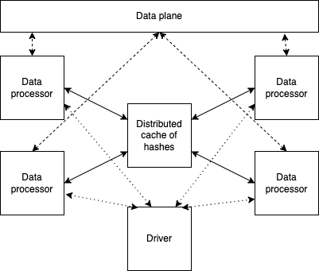

# Ededup Python Transform 

Please see the set of [transform project conventions](../../../README.md#transform-project-conventions) for details on
general project conventions, transform configuration, testing and IDE set up.

## Contributors
- Boris Lublinsky (blublinsk@ibm.com)

## Description
This Python implementation of the exact deduplication transform uses "streaming" deduplication based on a central hash.
As shown below, it relies on a distributed hash cache and data processors that read documents, generate hashes,
coordinate with the cache to remove duplicates, and store unique documents in the data plane.



Mapping this model to the transform model is complicated by the need for a hash cache, which the transform model does
not recognize. The solution is to have the transform runtime create the hash cache and pass it as a parameter to the
transforms. The transform runtime handles hash cache creation and enhances statistics with details about cache size and
utilization.

### Incremental Execution and Snapshotting

The current implementation includes snapshotting, where the hash cache is saved to storage (local disk or S3) at the
end of execution. This enables incremental deduplication: you can run deduplication on existing files, save the hash
cache, and later load the snapshot to deduplicate only new files, avoiding reprocessing the entire dataset.

## Input Columns Used by This Transform

| Input Column Name                                                   | Data Type | Description                      |
|---------------------------------------------------------------------|-----------|----------------------------------|
| Column specified by the _contents_column_ configuration argument    | str       | Column that stores document text |
| Column specified by the _document_id_column_ configuration argument | int64     | Column that stores document ID   |

## Output Columns Annotated by This Transform
This transform does not perform any annotations; it only filters out the documents that are marked as duplicates.

## Configuration

The set of dictionary keys holding [EdedupTransform](src/ededup_transform_python.py)
configuration for values (common for Python and Ray) are as follows:

* _doc_column_ - specifies name of the column containing documents
* _doc_id_column_ - specifies the name of the column containing a document id
* _use_snapshot_ - specifies that ededup execution starts with a set of pre-existing hashes, enabling incremental
execution
* _snapshot_directory_ - specifies the directory for reading snapshots. If not provided, the default is
`output_folder/snapshot`

## Usage

The following command line arguments (corresponding to the configuration keys described above) are available in addition
to the options provided by the [python launcher](../../../../data-processing-lib/doc/python-launcher-options.md).
```text
  --ededup_doc_column EDEDUP_DOC_COLUMN
                        name of the column containing document
  --ededup_doc_id_column EDEDUP_DOC_ID_COLUMN
                        name of the column containing document id
  --ededup_use_snapshot EDEDUP_USE_SNAPSHOT
                        flag to continue from snapshot
  --ededup_snapshot_directory EDEDUP_SNAPSHOT_DIRECTORY
                        location of snapshot files  
```

### Running the samples
To run the samples, use the following `make` targets

* `run-cli-sample` - runs src/ededup_transform_python.py using command line args
* `run-local-sample` - runs src/ededup_local.py

These targets will activate the virtual environment and set up any configuration needed.
Use the `-n` option of `make` to see the detail of what is done to run the sample.

For example, 
```shell
make run-cli-sample
...
```
Then 
```shell
ls output
```
To see results of the transform.

### Code example

[notebook](../ededup.ipynb)

### Transforming data using the transform image

To use the transform image to transform your data, please refer to the 
[running images quickstart](../../../../doc/quick-start/run-transform-image.md),
substituting the name of this transform image and runtime as appropriate.

## Testing

Following [the testing strategy of data-processing-lib](../../../../data-processing-lib/doc/transform-testing.md)

Currently we have:
- [Unit test](test/test_ededup_python.py)
- [Integration test](test/test_ededup.py)

To use the transform image to transform your data, please refer to the 
[running images quickstart](../../../../doc/quick-start/run-transform-image.md),
substituting the name of this transform image and runtime as appropriate.
